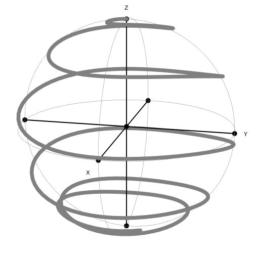

# BlochSphere
Mathematica functions that plot time-evolution on a Bloch Sphere.

Some example functions require the MaTeX package:
https://github.com/szhorvat/MaTeX

Many essential parts were taken from StackOverflow user glS:
https://mathematica.stackexchange.com/questions/125985/how-to-draw-an-interactive-mouse-clickable-3d-bloch-sphere


```Mathematica

energyGap = 9.3;
angularVelocity = 9;
resolution = 300;

(* Here, we define a 2x2 Hamiltonian using Pauli matrices X and Y *)

hamiltonian = energyGap * Z / 2 + Cos[ angularVelocity t ] X;
initialstate = {1, 0};

(* This function plots the evolution on a Bloch Sphere *)

EvolutionOnBlochSphere[ 
  hamiltonian               (* The Hamiltonian to be solved *)
  , initialstate            (* The state at initial time tmin *)
  , {t, 0, 1.1 Pi }         (* Time-interval to solve, assuming { [name of time variable], [initial time], [final time] } *)
  , resolution              (* Number of chunks used to plot the trajectory *)
]
```



